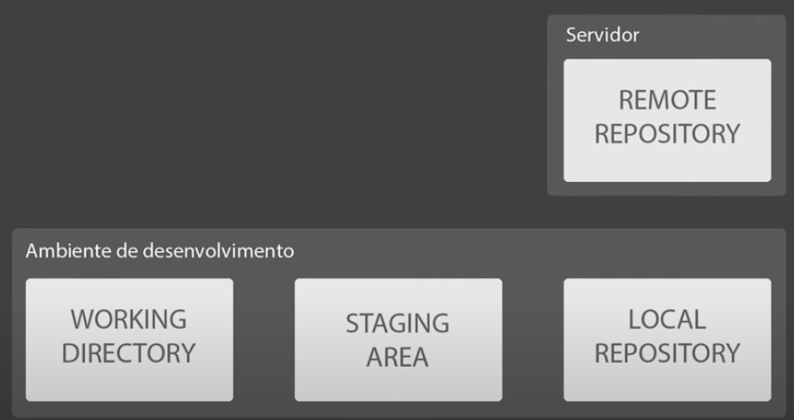

# Git e Github

## Intro

Git é um sistema de versionamento de código distribuído, essencial para a organização de um time ágil que trabalha com qualquer tipo de código.
Pilares do git:

* Controle de versões
* Gerenciamento distribuído
* Rastreabilidade
* Segurança

O Git consegue realizar o gerenciamento dos projetos, versionando diversos tipos de arquivos, sejam manuais em texto, imagens, arquivos de configuração, scripts ou linhas de código. O controle de versionamento destes arquivos garante rastreabilidade das mudanças, facilidade de rollback, ou seja retornar a um estado seguro em caso de alteração com erro e gerenciamento de conflitos quando existem times ou indivíduos diferentes alterando um mesmo arquivo.

## Como o git funciona debaixo dos panos

O git realiza o derenciamento de alterações através de um algoritimo seguro de hash(SHA), no caso ele mantem o hash do arquivo salvo em um objeto e compara com o hash atual do arquivo, caso diferirem ele sabe que o arquivo foi alterado.

#### SHA - Secure Hash Algorithm

Como dito anteriormente, o sha é um algoritimo de hash que retorna um valor _quase_ único que identifica o objeto em questão. O algoritimo utilizado é de 160 bits e não é possível reverter o hash criado para o valor original que foi criptografado.

```shell
echo "conteudo" | sha1sum -
5b0d0dda479cc03cce59528e28961e498155f5c  -
echo "onteudo" | sha1sum -
8feae1c68dbdfb512ce8514d87e1efe913a3f1e1  -
```

Como podemos ver no exemplo acima, duas strings muito parecidas(diferença de um caracter) geram resultados totalmente aleatórios e sem relação entre sí.

### **Objetos do git**

O git utiliza 3 tipos básicos de objetos para gerenciar os projetos:

| Blob | Tree | Commit  |
|:-: |- |-
|   |   | 
| O Obejto blob tem o conteúdo do arquivo + os metadados em sua composição (e isso é levado em consideração no hash como veremos abaixo)         Os metadados incluem o tipo de objeto, o tamanho, uma string \0 e o conteúdo do arquivo.  | Armazenam blobs, e commits, ´é uma estrutura composta. Guarda o tipo de blob, tamanho, \0 nome do arquivo e hash dele Monta a estrutura de diretorios  | Objeto que agrega todas as alterações realizadas, tem como metadados: tamanho, tree, parente(?commit?), autor, mensagem e timestamp
| `echo "conteudo" \| git hash-object --stdin fc31e91b26cf85a55e072476de7f263c89260eb1`  `echo -e "blob 9\0conteudo" \| sha1sum - fc31e91b26cf85a55e072476de7f263c89260eb1  -`  | Guarda as hashes dos arquivos e tem uma hash propria, ou seja, mudando um arquivo dentro do projeto, a tree irá ser alterada tambem  | Garante a rastreabilidade do sistema, com timestamp, as hashes, autor e mensagem do commit. Também possui hash (fica no log)

<div style="text-align:center">


</div>

## Enough chating

Agora que já entendemos o que é git e pra que ele serve, é hora de faze-lo funcionar.

Em um diretório vazio damos o comando `git init` e o terminal nos retorna uma saída como `Initialized empty Git repository in /home/user/dir/.git/` indicando que criou o repositório dentro do diretório .git, é ali que a magia acontece. Dentro deste diretório encontramos a seguinte esturura:

```shell
ls -A 
branches  config  description  HEAD  hooks  info  objects  refs
```

No .git temos o diretório branches, um conceito também fundamental que será visto mais adiante, arquivo de configurações que será abordado no proximo paragrafo, description, HEAD que auxiliará no gerenciamento de alterações de versionamento, diretório hooks, info, objects - que não por acaso são os blobs,trees e commits já estudados -, e diretorio refs.

Após a inicialização do repositório, devemos configura-lo, para isso usamos o comando `git config`, e parametrizamos ele de acordo com a necessidade. Falamos anteriormente que o objeto commit necessita armazenar mensagem, usuario e e-mail, iremos configurar agora alguns desses parametros.

`git config --global  user.name 'Maica1'` -> Nome de quem está utilizando o respositório.

`git config --global user.email 'maicon.vieira@outlook.com.br'` - Email que identificará o usuário

Dentro do diretório que foi inicializado o repositório, começamos a criar nosso projeto, criamos um arquivo e informamos ao git que ele irá gerenciar este arquivo, através do comando `git add filename`, caso não fizemos isso, o git saberá que o arquivo está dentro do projeto, mas não irá se preocupar com o gerenciamento deste como vemos a seguir:

```shell
git status
On branch master
No commits yet
Untracked files:
  (use "git add <file>..." to include in what will be committed)
  logs/
```

Este é o status do projeto, com este comando conseguimos verificar conflitos, o que está sendo gerenciado e foi alterado, ações a serem tomadas, etc.
Como o diretorio logs não está sendo gerenciado, vamos fazer como instruído e adiciona-lo ao projeto.

```shell
git status
On branch master


No commits yet

Changes to be committed:
  (use "git rm --cached <file>..." to unstage)
new file:   logs/zoom_stdout_stderr.log
```


* Untracked - Arquivos que não estão sendo gerenciados pelo git
* Tracked
  * Unmodified -> Arquivos gerenciados que não foram alterados
  * Modified -> Arquivo gerenciado que tem sua SHA1 diferente da que consta na base do git, caracterizando uma modificação/alteração no arquivo
  * Staged -> Arquivos prontos para serem commitados, versões de release.

### Gerenciador de versionamento distribuido

Quando dizemos que o git é um sistema distribuido de versionamento de código, falamos pois é realizada uma cópia local dos dados do servidor, e no momento em que alteramos esta cópia local as mudanças não se refletem automáticamente no repositório. Há então o gerenciamento de alterações comentado anteriormente que sinaliza e habilita as novas mudanças para o repositório remoto.



* Working dir -> Arquivos não modificados
* Staging area -> Arquivos aguardando commit
* Local repository -> arquivos que foram comitados

FAZER UM TESTE DE RESTORE
